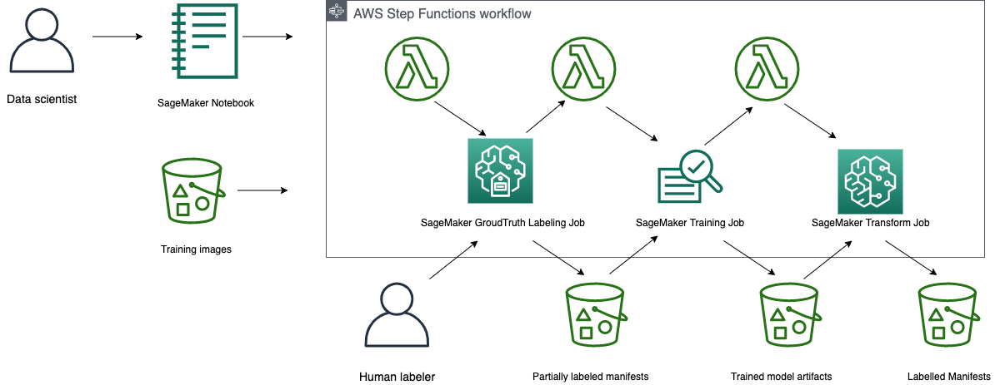

# Visual Perception for Autonomous Vehicles using Active Learning

Training computer vision models for autonomous driving to achieve high-end performance requires large labeled datasets, which can be prohibitively expensive. This project shows an end to end pipeline that streamlines the process of labelling driving scene datasets for a task, using [SageMaker Groundtruth](https://aws.amazon.com/sagemaker/groundtruth/) autolabelling and active learning. The task that we focus is pedestrian detection in camera images. 

The project focuses on an object detection task where the goal of the final trained model is to predict 2D bounding boxes around pedestrians in an image.

The active learning pipeline ensures that, starting with just a handful of a labels we can train a model, predict bounding boxes, compare the models predictions to a real labels and only add more labels if we need to increase the performance of the model. 

Using Step Functions, we can create a workflow that automates this process and iteratively performs the active learning loop.

## Getting Started

To get started quickly, use the following quick-launch link to create a CloudFormation stack and deploy the resources in this project.

| Region | Stack |
| ---- | ---- |
|US West (Oregon) |   |
|US East (N. Virginia) |   |
|US East (Ohio) |   |

On the stack creation page, check the boxes to acknowledge creation of IAM resources and auto-expand, and click **Create Stack**.

Once the stack is created, go to the Outputs tab and click on the SageMakerNotebook link. This will open up the jupyter notebook in a SageMaker Notebook instance where you can run the code in the notebook.

## Architecture
The project architecture deployed by the cloud formation template is shown here.

## Contents

* `deployment/`
  * `template.yaml`: Creates AWS CloudFormation Stack for solution
  * `permissions.yaml`: Creates AWS CloudFormation Stack for an IAM role with permissions for all actions needed by the solution
* `source/`
  * `lambda/`
    * `active-learning-1p/`: Lambda package for active learning using SageMaker built-in algorithms.
  * `sagemaker/`
    * `artifacts/`
      * `annotations_metadata.json`: Metadata for SageMaker Groundtruth labelling job
      * `class_labels`: Class label information for SageMaker Groundtruth labelling job
      * `instructions.template`:  SageMaker Groundtruth Labeling job template for 2D bounding box
    * `data/`: for storing image data locally
    * `manifests/`: stores manifest files
    * `package/`
      * `active_learning/`
        * `prepare.py`: Contains functions for preparing manifests and configurations for Active Learning loop
        * `request.py`: Create Input requests to initiate Active Learning loop
        * `step_functions.py`: Front end for Step Functions State Machine implementing Active Learning loop
      * `config.py`: Contains solution configuration
      * `manifest.py`: Utilities for manipulating manifests
      * `requirements.txt`: python dependencies for notebook
      * `setup.py`: Build solution code as package
      * `workteam.py`: Utilities for manipulating SageMaker Groundtruth private workteam
    * `active-learning-visual-perception.ipynb`: Orchestrates the solution. Triggers active learning loop

## License

This project is licensed under the Apache-2.0 License.

